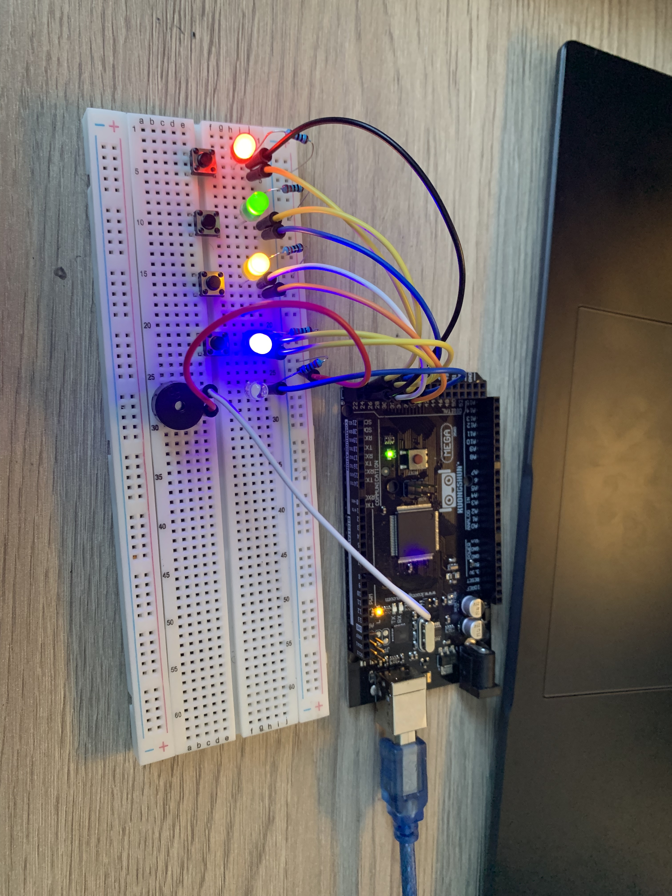

# Project 1: Color Memory Game (Arduino Mega) — Build Notes

## Build

## Notes
We are building a Simon-style color memory game on an Arduino Mega.  
This doc covers the full hardware setup, pin mapping, and how the code is structured (v1 LEDs + buttons + buzzer, v2 adds an LCD).

---
## Hardware Overview
**Main board:** Arduino Mega 2560  
**Inputs:** Push buttons (player input)  
**Outputs:** LEDs (pattern display), buzzer (sound feedback)  

---

## Pin Map (v1)
LED pins:
- LED1 (Red)  -> D2
- LED2 (Green)-> D3
- LED3 (Blue) -> D4
- LED4 (Yellow)-> D5

Button pins (recommended: INPUT_PULLUP):
- BTN1 -> D6
- BTN2 -> D7
- BTN3 -> D8
- BTN4 -> D9

Buzzer:
- BUZZER -> D10

Power:
- 5V  -> breadboard + rail (if needed)
- GND -> breadboard - rail (common ground)

> Update these pin numbers to match your actual wiring.

---

## Wiring Guide

### LEDs
For each LED:
- **Anode (long leg)** -> Arduino pin (D2–D5)
- **Cathode (short leg)** -> **220Ω resistor** -> GND

### Buttons (INPUT_PULLUP)
For each button:
- One side -> **GND**
- Other side -> Arduino pin (D6–D9)

### Buzzer
- **Positive leg** -> Arduino pin D10  
- **Negative leg** -> GND  

The buzzer gives sound feedback during the game, such as when a color is played or a button is pressed.

---

## How the Game Logic Works (v1)
- The Arduino stores a sequence (e.g., `[2, 0, 3, 1]`)
- Each round it adds one new random step
- LEDs play the full sequence
- The buzzer sounds along with each step for audio feedback
- Player repeats the sequence via buttons
- Button presses can also trigger matching sounds
- If wrong input -> game over lights flash and error sound can play

---

## Upload & Test
1. Upload the `.ino` file
2. Confirm each LED turns on
3. Confirm each button press registers correctly
4. Confirm the buzzer makes sound during sequence playback and button presses
5. Start game and test sequence playback + input checking

