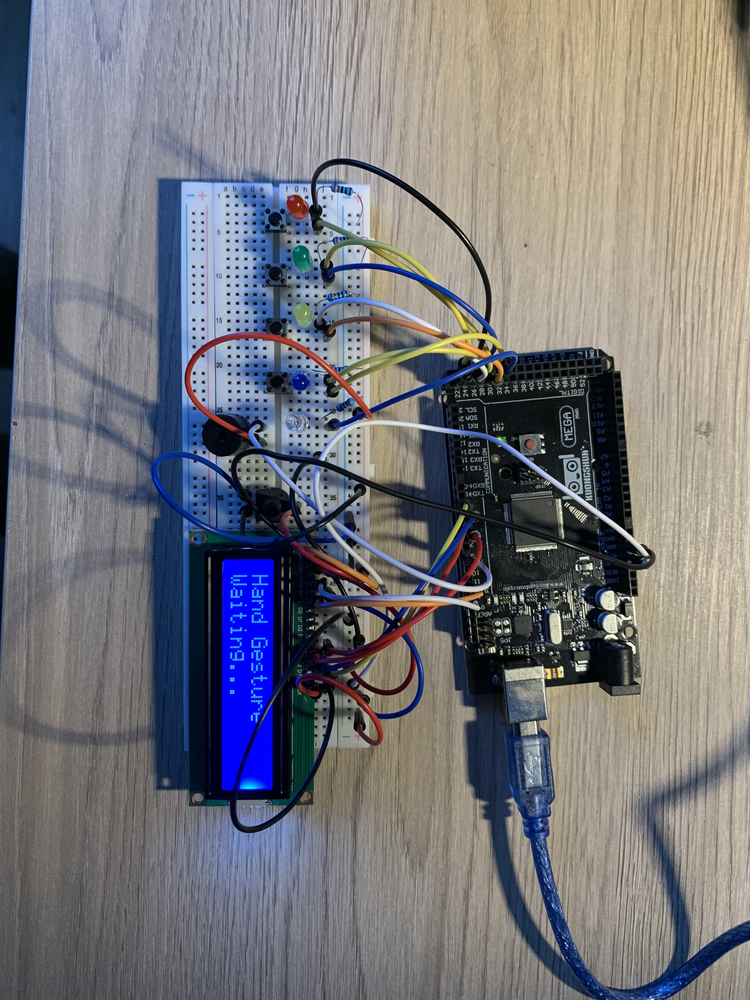

# Color Memory Game — v1 (Arduino Mega)

A Simon-style color memory game built on an **Arduino Mega 2560** using **LEDs + buttons**.  
The game plays a growing LED pattern and the player repeats it using button inputs.

## What it does
- Generates a random LED sequence (pattern grows each round)
- Plays the pattern using LEDs
- Reads player input from buttons
- Ends the game on a wrong input (score = highest round reached)

## Version info
- **v1:** Core gameplay (LEDs + buttons)
- **v2 (planned):** Add an LCD for score, prompts, and clearer game feedback

## Documentation
- 📄 [Getting Started (wiring + pin map + notes)](Getting-started.md)

## Demo / Photos
> Add your photos in the `images/` folder, then update these links.

## Hardware (v1)
- Arduino Mega 2560
- LEDs + resistors (e.g., 220Ω)
- Push buttons
- Breadboard + jumper wires

## Future improvements
- LCD upgrade (v2)
- Difficulty scaling (faster playback each round)
- Sound feedback (buzzer) if available
- Cleaner enclosure / mounting
